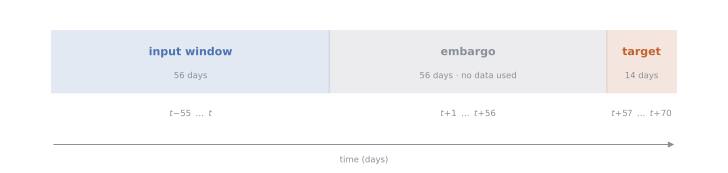
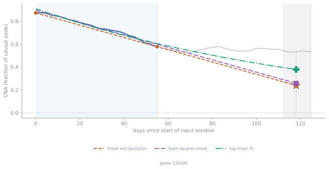

# Summary of objective

Build a machine learning program that allows a user to input a CSV file of historical daily average playercounts for a video game and receive as an output an estimate for the average playercount roughly two months into the future.

The motivation for such a model would be for developers and publishers of video games to have an early warning of severe playercount decline, upon which appropriate actions could be taken to mitigate such an event.

**Dataset.** The model has been developed using *Steam Games Dataset: Player count history, Price history and data about games* — Wannigamage, Barlow, Lakshika & Kasmarik (UNSW Canberra), 2020. DOI [10.17632/ycy3sy3vj2.1](https://data.mendeley.com/datasets/ycy3sy3vj2/1), CC BY 4.0. This dataset consists of playercounts for 2000 Steam games (chosen as the games with the highest playercount within the 24 hours ending on the 11th December 2017) over a ~3 year period. 

The dataset has been truncated at the 14th of March 2020, approximately the beginning of the global COVID pandemic to remove the possibility of learning anomalous patterns of playercounts brought on by lockdowns.

# Data engineering

## Preprocessing pipeline

**Rolling averages**: The original dataset is fragmented into two subsets of 1000 games each with different frequency of playercount measurements; the first subset having playercounts measured every 5 minutes, and the second having playercounts measured each hour. These are homogenised into daily average playercounts as we do not expect intra-day playercount variations to be significant in predicting playercounts two months into the future. Furthermore, video game playercounts typically have repetetive variations over the course of a week, due to the weekday/weekend cycle. Therefore, we compute a rolling 14-day average of the playercount to smooth out these variations.

**Causal normalisation**: Due to the large variation in playercount magnitude (the largest game peaking at a rolling average of ~1.6M daily players and the smallest at ~100 players) we choose to normalise (divide) the average playercount for a specific day by the *causal peak* with respect to that day. That is to say the largest value that the rolling average playercount for a game has achieved up until that day. Maintaining that the causal peak is used as opposed to the all-time peak (which is available during training but would of course not be in a real use case) is essential for preventing data leakage. From now on we refer to the causally normalised rolling average playercounts as the 'CNA' playercounts for brevity.

**Lower cutoff filter**: Games that do not ever have a recorded peak rolling average playercount of at least 100 are dropped from the dataset. This reduces the games in our dataset from 2000 to 1486. The reason for this is that we are trying to predict negative changes in the rolling average playercounts by *orders of magnitude*, which could be called 'playerbase collapses'. So if a game's playerbase is too small the random stochastic variations in playercount will be of the same order of magnitude as the 'playerbase collapses' we are trying to detect, leading to training examples which have similar patterns to the playerbase collapse of a larger game, but a different underlying mechanism.

## Sliding window data extraction

To generate training(/development) and test examples we will move a sliding set of windows over the CNA playercounts for each game which have the structure:
{#fig-sliding-window width=100%}
If any NaN values are detected in the input or target windows then the sample is rejected and the entire set of windows is shifted along by the width of the target window. Else, a data point is generated consisting of input features derived from the 56 input window playercounts and a target variable derived from the 14 day target counts, and the set of windows is shifted with a stride of 14 days.

Since the sliding windows partialy overlap two data points can come from the same game's CNA playercounts which share data and therefore they must not be split into the train and test sets. For this reason we group the data by the game from which it arose and make a train/test split by the game's id after shuffling the games. For model development we will also therefore use grouped K-fold cross validation where the grouping is done by game id.

This procedure applied to the dataset resulted in ~74k example data points to train/develop/test our models with. We will describe several choices made for the features and target variables over the course of exploring the space of models.

## Feature and target choices
**Features**: Our raw input features are the 56 CNA playercounts. Of course as these are a time series they are heavily correlated to eachother and so a natural approach would be to try to distill these counts into a smaller set of summary statistics. However, since the precise features to use is tied to the particular model one is training, we will be more explicit about the input features on a model by model basis in the next sections.


**Target**: The initial choice for the target was the average of the rolling average playercounts over the future window, divided by the causal peak *at the current time (i.e. at the end of the input window)*. This choice normalises the target playercount with respect to the highest achieved playercount, whilst protecting against temporal data leakage. The issue with this target however was that in the training data it was heavily right-skewed  due to most games having typical playercounts that are orders of magnitude fewer than their all time highs. This skewness can lead to outliers dominating the squared error loss and issues with ML models that rely on optimising this loss, and so we choose to log-transform the target (with a regulator of 0.01) as shown below.

{#fig-log-target width=100%}


# Baselines and models
## Baselines
Before evaluating various models, we should set a benchmark or baseline performance measure against which to judge. We take the performance metric to be the root mean squared error of the log transformed target and choose two crude baseline models (all linear approximations are rectified so as to not produce negative predictions): 

1) linear extrapolation: take a straight line through the CNA count at the start and end of the input window and extrapolate it 56 + 7 days into the future and predict that value. 
2) a dummy regressor with 'mean' strategy: compute the mean of the target across all training examples and predict this for any input.

The resulting performances are in the below table, reported in terms of root-mean-squared-error (RMSE) on the log target. To get a measure of the actual error that the model will have when predicting the actual playercounts themselves rather than their logarithm one should calculate $\exp(\textrm{RMSE})$. For example the dummy model below has a log target RMSE of 1.052 which would translate to $\exp(1.052)\approx 2.863$ which corresponds to an error on the raw playercounts of around 186%.

| Model | CV RMSE (log target) |
|---|---|
| Dummy (predict the mean) | 1.052 |
| Linear extrapolation of the window | 1.135 |

For the linear extrapolation above we only used the boundary points of the window which could be misrepresentative of the entire window due to random fluctuations, so two other slightly more sophisticated baseline models are:

3) Linear fit to input window CNA playercounts using least squares and extrapolation of this line to the future window.
4) Linear fit to the log of the input window CNA playercounts using least squares and extrapolation as above.

| Model | CV RMSE (log target) |
|---|---|
| Linear fit to CNA | 1.331 |
| Linear fit to log CNA | 1.039 |

TODO: intro text for the example browser below.

Various baseline model predictions on an example training window. The orange curve is a linear extrapolation using only the end points of the input window, the purple is a linear fit to the CNA playercounts of the input window and the green is a linear fit to the log of the CNA. The actual CNA future values are shown in the background.

```{=html}
<style>
  #extrap-viewer #extrap-number {
    background: transparent;
    color: inherit;
    border: 1px solid rgba(128, 128, 128, 0.5);
    border-radius: 3px;
    padding: 0.1em 0.2em;
  }
  #extrap-viewer label { color: inherit; }
</style>
<div id="extrap-viewer" style="margin: 0.5em 0 1.5em 0;">
  <div style="display: flex; align-items: center; gap: 0.75em; margin-bottom: 0.5em;">
    <label for="extrap-slider" style="white-space: nowrap;">Example
      <input type="number" id="extrap-number" min="1" max="50" value="1"
             style="width: 4em; text-align: center;"> of 50</label>
    <input type="range" id="extrap-slider" min="1" max="50" value="1"
           style="flex: 1;" aria-label="choose example window">
  </div>
  
</div>
<script>
  (function () {
    const slider = document.getElementById("extrap-slider");
    const number = document.getElementById("extrap-number");
    const img = document.getElementById("extrap-img");
    function show(v) {
      v = Math.min(50, Math.max(1, Math.round(Number(v) || 1)));
      slider.value = v;
      number.value = v;
      img.src = `figs/extrap_examples/example_${String(v).padStart(2, "0")}.svg`;
    }
    slider.addEventListener("input", () => show(slider.value));
    number.addEventListener("change", () => show(number.value));
  })();
</script>
```

## Gradient-boosted trees

Gradient boosted tree based methods are typically recommended for learning from tabular time series data. The motivation behind using boosted trees are that they can find non-linear mappings between features and the target, and also that they naturally handle features of different types and scales (such as the time index feature we use) naturally.

We use scikit-learn's HistGradientBoostingRegressor trained on an input consisting of the 56-day input window as before, but supplemented with the date index of the input window's final day (i.e. the current time $t$), as well as the logarithm of the historical (causal) CNA peak of the game. This last feature was included to re-introduce information about the overall size of the game's playerbase which was lost when we performed causal normalisation in order to get the features uniformly normalised across different games. The result after training with default hyperparameters is:


| Model | CV RMSE | Typical multiplicative error |
|---|---|---|
| Dummy | 1.052 | ×/÷ 2.9 |
| HistGBR (window + time + log peak) | 0.4471 | ×/÷ 1.6 |

showing a vast improvement over the dummy model, even before any hyperparameter tuning.

### Hyperparameter tuning (does not help)

## Feature reduction

A natural direction at this point is to determine which features are leading to better model performance. To determine this we remove features one by one from the input and measure the (grouped 5-fold cross validated) RMSE of the HistGradientBoostingRegressor with default hyperparameters. The input array for a single example has the structure: [56 counts chronologically ordered, index of current time, log(causal peak)] and we start removing features from the end. We see that removing the last two features causes a jump in the error, beyond which removing each daily CNA count steadily makes the error worse and worse as expected. This is somewhat an obvious result but the initial jump in the error confirms that adding the "global" features of current time index and log(causal peak) provides useful information to the model.

{#fig-ablation width=100%}

It is interesting to see that even when only including one feature which would be the first CNA count of the input window, the HistGBR is able to achieve an RMSE on the log target of around 0.60 which is still a vast improvement compared to the baseline models. 


## Decay rate features
Based on the finding that CNA playercount data from before the input window contains information that can improve the RMSE of the tabular model we look for other features that could be added to the input based on this 'global' historic data. For example we first make the assumption that the CNA playercount declines exponentially from the causal peak and from this assumption we can estimate the 'decay rate' $\lambda$ and add this decay rate as a feature. 

We estimate the decay rate in two ways:

1. $\lambda \approx \frac{1}{\text{time since peak}}\log\left(\text{CNA today} + 0.01\right)$
2. Slope of the linear regression of $\log\left(\text{CNA}\right)$ since the previous peak.


| Features | CV RMSE (log target) |
|---|---|
| Window + time + log peak (no decay features) | 0.4465 |
| Including decay rate $\lambda$ from method 1. | 0.4446 |
| Including decay rate $\lambda$ from method 2. | 0.4422 |

Both of these features seem to improve the model performance but only negligably.

The underlying assumption that the CNA playercounts follow an exponential decay after a causal peak is flawed in that it assumes the game's playercount continually decreases after its all time high which is usually not the case. A better assumption would be to include some steady state mode to capture the signal of games that maintain a steady playerbase:

$$\text{cna}(t) = N\left(e^{-\lambda t} - 1\right) + 1$$

In this case the fitting is non-linear (`scipy.optimize.curve_fit`), so unlike the polyfit version
it can fail to converge; those windows fall back to $(N, \lambda) = (0, 0)$.


# Conclusions


# Remaining work


# References
