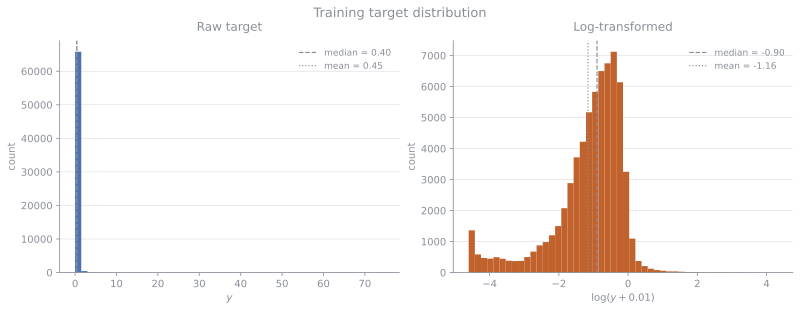

<!--
SKELETON: each section lists what to write and which notebook cells / files
the material comes from. All numbers quoted are real results from
notebooks/data_engineering.ipynb and notebooks/tag_features.ipynb.
Replace TODO blocks with prose and figures; delete these comments as you go.
-->

# Summary of objective

Build a machine learning program that allows a user to input a CSV file of historical daily average playercounts for a video game and receive as an output an estimate for the average playercount roughly two months into the future.

The motivation for such a model would be for developers and publishers of video games to have an early warning of severe playercount decline, upon which appropriate actions could be taken to mitigate such an event.

**Dataset.** The model has been developed using *Steam Games Dataset: Player count history, Price history and data about games* — Wannigamage, Barlow, Lakshika & Kasmarik (UNSW Canberra), 2020. DOI [10.17632/ycy3sy3vj2.1](https://data.mendeley.com/datasets/ycy3sy3vj2/1), CC BY 4.0. This dataset consists of playercounts for 2000 Steam games (chosen as the games with the highest playercount within the 24 hours ending on the 11th December 2017) over a ~3 year period. The dataset has been truncated at the 14th of March 2020, approximately the beginning of the global COVID pandemic to remove the possibility of learning anomalous patterns of playercounts brought on by lockdowns.

# Data engineering

## Preprocessing pipeline

**Rolling averages**: The original dataset is fragmented into two subsets of 1000 games each with different frequency of playercount measurements; the first subset having playercounts measured every 5 minutes, and the second having playercounts measured each hour. These are homogenised into daily average playercounts as we do not expect intra-day playercount variations to be significant in predicting playercounts two months into the future. Furthermore, video game playercounts typically have repetetive variations over the course of a week, due to the weekday/weekend cycle. Therefore, we compute a rolling 14-day average of the playercount to smooth out these variations.

**Causal normalisation**: Due to the large variation in playercount magnitude (the largest game peaking at a rolling average of ~1.6M daily players and the smallest at ~100 players) we choose to normalise (divide) the average playercount for a specific day by the *causal peak* with respect to that day. That is to say the largest value that the rolling average playercount for a game has achieved up until that day. Maintaining that the causal peak is used as opposed to the all-time peak (which is available during training but would of course not be in a real use case) is essential for preventing data leakage. From now on we refer to the causally normalised rolling average playercounts as the 'CNA' playercounts for brevity.

**Lower cutoff filter**: Games that do not ever have a recorded peak rolling average playercount of at least 100 are dropped from the dataset. This reduces the games in our dataset from 2000 to 1486. The reason for this is that we are trying to predict negative changes in the rolling average playercounts by *orders of magnitude*, which could be called 'playerbase collapses'. So if a game's playerbase is too small the random stochastic variations in playercount will be of the same order of magnitude as the 'playerbase collapses' we are trying to detect, leading to training examples which have similar patterns to the playerbase collapse of a larger game, but a different underlying mechanism.

## Sliding window data extraction

To generate training(/development) and test examples we will move a sliding set of windows over the CNA playercounts for each game which have the structure:
```
[<--- 56d input window --->][<--- 56d embargo --->][<- 14d target ->]
 t-55 .................. t   t+1 ............ t+56  t+57 ...... t+70
                                (no data used)
```
If any NaN values are detected in the input or target windows then the sample is rejected and the entire set of windows is shifted along by the width of the target window. Else, a data point is generated consisting of input features derived from the 56 input window playercounts and a target variable derived from the 14 day target counts, and the set of windows is shifted with a stride of 7 days.

Since the sliding windows partialy overlap two data points can come from the same game's CNA playercounts which share data and therefore they must not be split into the train and test sets. For this reason we group the data by the game from which it arose and make a train/test split by the game's id after shuffling the games. For model development we will also therefore use grouped K-fold cross validation where the grouping is done by game id.

This procedure applied to the dataset resulted in ~150k example data points to train/develop/test our models with. We will describe several choices made for the features and target variables over the course of exploring the space of models.

## Feature and target choices
**Features**: Our raw input features are the 56 CNA playercounts. Of course as these are a time series they are heavily correlated to eachother and so a natural approach would be to try to distill these counts into a smaller set of summary statistics. However, since the precise features to use is tied to the particular model one is training, we will be more explicit about the input features on a model by model basis in the next sections.


**Target**: The initial choice for the target was the average of the rolling average playercounts over the future window, divided by the causal peak *at the current time (i.e. at the end of the input window)*. This choice normalises the target playercount with respect to the highest achieved playercount, whilst protecting against temporal data leakage. The issue with this target however was that in the training data it was heavily right-skewed  due to most games having typical playercounts that are orders of magnitude fewer than their all time highs. This skewness can lead to outliers dominating the squared error loss and issues with ML models that rely on optimising this loss, and so we choose to log-transform the target (with a regulator of 0.01) as shown below.

{#fig-log-target width=100%}


# Baselines and models
## Baselines
Before evaluating various models, we should set a benchmark or baseline performance measure against which to judge. We take the performance metric to be the root mean squared error of the log transformed target and choose two crude baseline models (all linear approximations are rectified so as to not produce negative predictions): 

1) linear extrapolation: take a straight line through the CNA count at the start and end of the input window and extrapolate it 56 + 7 days into the future and predict that value. 
2) a dummy regressor with 'mean' strategy: compute the mean of the target across all training examples and predict this for any input.

The resulting performances are in the below table, reported in terms of root-mean-squared-error (RMSE) on the log target. To get a measure of the actual error that the model will have when predicting the actual playercounts themselves rather than their logarithm one should calculate $\exp(\textrm{RMSE})$. For example the dummy model below has a log target RMSE of 1.052 which would translate to $\exp(1.052)\approx 2.863$ which corresponds to an error on the raw playercounts of around 186%.

| Model | CV RMSE (log target) |
|---|---|
| Dummy (predict the mean) | 1.052 |
| Linear extrapolation of the window | 1.135 |

For the linear extrapolation above we only used the boundary points of the window which could be misrepresentative of the entire window due to random fluctuations, so two other slightly more sophisticated baseline models are:

3) Linear fit to input window CNA playercounts using least squares and extrapolation of this line to the future window.
4) Linear fit to the log of the input window CNA playercounts using least squares and extrapolation as above.

| Model | CV RMSE (log target) |
|---|---|
| Linear fit to CNA | 1.331 |
| Linear fit to log CNA | 1.039 |

### A note about the RMSE

## Linear regression on summary statistics
As a first step beyond baseline models we can try to fit a linear regression model to a set of summary statistics that are derived from the input 56 day window. As a first try we can consider...

## Gradient-boosted trees

Gradient boosted tree based methods are typically recommended for learning from time series data. The reasons behind using boosted trees are: ... (Scale inv, nan handling, large tabular rows, interactions via splits) (fill in section)


We use scikit-learn's HistGradientBoostingRegressor trained on an input consisting of the 56-day input window as before, but supplemented with the date index of the input window's final day (i.e. the current time $t$), as well as the logarithm of the historical (causal) CNA peak of the game. This last feature was included to re-introduce information about the overall size of the game's playerbase which was lost when we performed causal normalisation in order to get the features uniformly normalised across different games. The result after training with default hyperparameters is:


| Model | CV RMSE | Typical multiplicative error |
|---|---|---|
| Dummy | 1.052 | ×/÷ 2.9 |
| HistGBR (window + time + log peak) | 0.4471 | ×/÷ 1.6 |

showing a vast improvement over the dummy model, even before any hyperparameter tuning.

# The information ceiling

<!-- This is the central scientific finding of the project: five independent
experiment families all failed to improve on ~0.445, implying the remaining
error is not model-limited but information-limited. One subsection each: -->

## Feature reduction: level dominates shape

<!-- TODO: reduction experiments. Two oldest window columns alone -> 0.58;
last 3 features -> 0.50; full window -> 0.447 (dummy 1.05). Most of the
model's skill is level-tracking; window shape contributes the final ~25%. -->

## Decay-rate features are redundant

<!-- TODO: two-point λ + time-since-peak -> 0.4441; polyfit λ -> 0.4455.
Both within fold noise (~0.013) of baseline 0.4471. Interpretation:
trajectories are near-Markovian — given current level and recent trend,
older history adds nothing. Include the λ NaN-mask bug as a lessons-learned
note (feature silently missing for gap-crossing windows; HistGBR's native
NaN handling masked the failure). -->

## Hyperparameter search: a flat loss surface

<!-- TODO: 40-draw randomised search over 7 hyperparameters -> best 0.4416,
i.e. under one standard error of fold noise; top-10 configs span 100× in
capacity yet sit within 0.003 of each other. Defaults were already at the
ceiling. -->

## More data does not help

<!-- TODO: stride 7 instead of 14 doubles the training set (132,848 ->
same games, denser windows) -> 0.4460, unchanged. Note the methodological
trap fixed along the way: changing future_window changes the TARGET, not
just the stride — the first version of this experiment was invalid. -->

## Static metadata is redundant with behaviour

<!-- TODO: tag experiment (notebooks/tag_features.ipynb). Top-50 many-hot
tags, train-only vocabulary. Window + tags -> 0.4450 vs 0.4461 (paired diff
−0.0012, noise). But tags ALONE -> 0.9153 vs dummy 1.05 — tags carry real
signal, all of it already expressed in the playercount trajectory.
"What a game is" is subsumed by "how its playercount behaves". -->

# Error analysis

<!-- TODO: out-of-fold predictions via cross_val_predict; big errors defined
as |residual| > 1. Three findings, one figure each (histograms big vs small
errors):
1. errors concentrate in windows near the START of the collection period
   (selection bias: games sampled at their hype peak; immature causal
   normalisation early on)
2. errors concentrate at LOW log causal peak (< ~4.5, i.e. peaks under ~90
   players): integer-level noise is proportionally huge in log space
3. errors concentrate at HIGH fitted decay rate (mid-collapse games:
   extrapolating fast transients 9 weeks out is intrinsically high-variance)
Interpretation: error lives where the target is intrinsically least
predictable — heteroscedastic, largely aleatoric. -->

# Productisation: the `player-forecast` package

<!-- TODO: describe player_forecast/ — pip-installable package + CLI that
turns the pipeline into a v0 product:
- input: any daily playercount CSV (>= 56 days); output: predicted average
  daily players for days 57-70 after the last observation
- refuses rather than guesses: validation errors for short/gappy input,
  out-of-domain warnings for small games
- FEATURE_VERSION-stamped model artifacts; 16-test unittest suite
- trained on all 1,486 games (147,668 windows — exactly reproducing the
  notebook's extraction): CV RMSE 0.4652
- one deliberate delta from the research configuration: the dataset-era
  time-index feature is dropped (not computable for arbitrary dates) -->

# Conclusions

<!-- TODO: 3-4 paragraphs.
- A rigorously-evaluated forecaster: ×/÷1.6 typical error at 9 weeks vs
  ×/÷2.9 for no model, at the demonstrated information limit of
  history-only forecasting.
- The ceiling finding: five independent null results converge; remaining
  error is event-driven (sales, updates, streamers) and irreducible without
  time-varying external data.
- Honest framing: the model answers the scale question (600k vs 60k vs 6k),
  not the 20% question. -->

# Remaining work

<!-- TODO, in priority order:
1. FINAL TEST-SET EVALUATION — the 149 held-out games (14,820 windows) have
   never been touched; the headline number of the finished report must come
   from them, evaluated exactly once.
2. Stratified metrics: RMSE by peak size and by period, so the blended 0.45
   doesn't understate performance on established games.
3. Quantile forecasts (HistGBR loss="quantile", 10/50/90%) for honest
   uncertainty bands in the product.
4. Time-varying external features — the only direction with a live
   mechanism after the ceiling result: calendar seasonality, market-wide
   activity index, sale/update events.
5. Housekeeping: signed-residual check on the big-error segments; per-fold
   score persistence (done for the package); model_scores key hygiene. -->

# References

<!-- @wannigamage2020 is already in references.bib (check); add sklearn
citation if desired. -->
